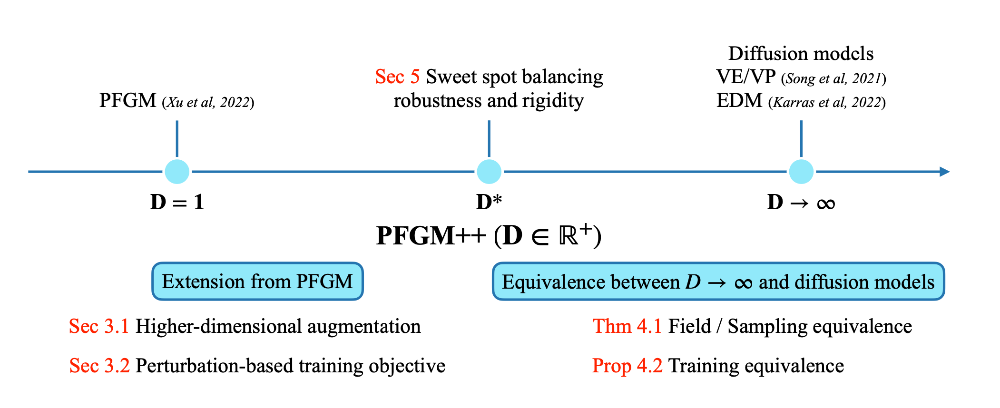
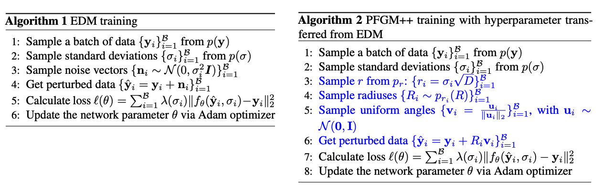
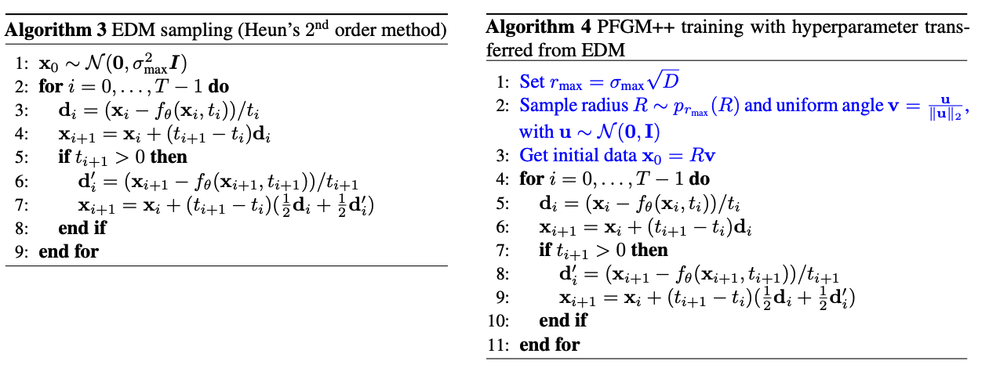

# PFGM++: Unlocking the Potential of Physics-Inspired Generative Models

[](https://paperswithcode.com/sota/image-generation-on-cifar-10?p=pfgm-unlocking-the-potential-of-physics)

Pytorch implementation of the paper [PFGM++: Unlocking the Potential of Physics-Inspired Generative Models](https://arxiv.org/abs/2302.04265)

by [Yilun Xu](http://yilun-xu.com), [Ziming Liu](https://kindxiaoming.github.io/#pub), [Yonglong Tian](https://people.csail.mit.edu/yonglong/), Shangyuan Tong, [Max Tegmark](https://space.mit.edu/home/tegmark/), [Tommi S. Jaakkola](http://people.csail.mit.edu/tommi/)

[[Slide](https://www.dropbox.com/s/0cgacob54vw7boe/jizhi_5_13_22.pptx?dl=0)]


😇 *Improvements over [PFGM](https://github.com/Newbeeer/Poisson_flow) / Diffusion Models:*

- No longer require the large batch training target in *PFGM*, thus enable **flexible conditional generation and more efficient training!**
- More general $D \in \mathbb{R}^+$ dimensional augmented variable. **PFGM++ subsumes PFGM and Diffusion Models**: *PFGM* correspond to $D=1$ and *Diffusion Models* correspond to $D\to \infty$.
- Existence of **sweet spot** $D^*$ in the middle of $(1,\infty)$!
- Smaller $D$ **more robust** than *Diffusion Models* ( $D\to \infty$ )
- Enable the **adjustment for model robustness and rigidity**!
- Enable **direct transfer of well-tuned hyperparameters** from any existing *Diffusion Models* ( $D\to \infty$ )


---


*Abstract:* We present a general framework termed *PFGM++* that unifies diffusion models and Poisson Flow Generative Models (PFGM). These models realize generative trajectories for $N$ dimensional data by embedding paths in $N{+}D$ dimensional space while still controlling the progression with a simple scalar norm of the $D$ additional variables. The new models reduce to **PFGM when $D{=}1$** and to **diffusion models when $D{\to}\infty$.** The flexibility of choosing $D$ allows us to trade off robustness against rigidity as increasing $D$ results in more concentrated coupling between the data and the additional variable norms. We **dispense with the biased large batch field targets used in PFGM and instead provide an unbiased perturbation-based objective** similar to diffusion models. To explore different choices of $D$, we provide a direct alignment method for transferring well-tuned hyperparameters from diffusion models ( $D{\to} \infty$ ) to any finite $D$ values. Our experiments show that models with **finite $D$ can be superior to previous state-of-the-art diffusion models** on CIFAR-10/FFHQ $64{\times}64$ datasets, with FID scores of $1.91/2.43$ when $D{=}2048/128$. In class-conditional generation, $D{=}2048$ yields **current state-of-the-art FID of $1.74$ on CIFAR-10**. In addition, we demonstrate that models with smaller $D$ exhibit **improved robustness** against modeling errors.



---


## Outline

Our implementation is built upon the [EDM](https://github.com/NVlabs/edm) repo. We first provide an [guidance](#quick-adoptation) on how to quickly **transfer the hyperparameter from well-tuned diffusion models** ( $D\to \infty$ ), such as **EDM** and **DDPM**, **to the PFGM++ family** ( $D\in \mathbb{R}^+$ ) in a task/dataset agnostic way (We provide more details in *Sec 4* ( Transfer hyperparameters to finite $D$ ) and *Appendix C.2* in our paper). We highlight our modifications based on their original command lines for [training](#training-new-models-with-stf), [sampling and evaluation](#generate-&-evaluations).  We provide checkpoints in [checkpoints](#checkpoints) section.

We also provide the original instruction for [set-ups](#the-instructions-for-set-ups-from-edm-repo), such as environmental requirements and dataset preparation, from EDM repo.


## Transfer guidance by $r=\sigma\sqrt{D}$ formula

Below we provide the guidance for how to quick transfer the well-tuned hyperparameters for diffusion models ( $D\to \infty$ ), such as  $\sigma_{\textrm{max}}$ and $p(\sigma)$ to finite $D$s. We adopt the $r=\sigma\sqrt{D}$ formula in our paper for the alignment (c.f. Section 4). Please use the following guidance as a prototype.

 😀 **Please adjust the augmented dimension $D$ according to your task/dataset/model.**


*Training hyperparameter transfer*. The example we provide is a simplified version of  [`loss.py`]([https://github.com/Newbeeer/stf/blob/13de0c799a37dd2f83108c1d7295aaf1e993dffe/training/loss.py#L78-L118) in this repo.



```python
def train(y, N, D, pfgmpp):
  '''
  y: mini-batch clean images
  N: data dimension
  D: augmented dimension
  pfgmpp: use PFGM++ framework, otherwise diffusion models (D\to\infty case). options: 0 | 1
  '''
  
  if not pfgmpp:
    ###################### === Diffusion Model === ######################
    rnd_normal = torch.randn([images.shape[0], 1, 1, 1], device=images.device)
    sigma = (rnd_normal * self.P_std + self.P_mean).exp() # sample sigma from p(\sigma)
    n = torch.randn_like(y) * sigma
    D_yn = net(y + n, sigma)
    loss = (D_yn - y) ** 2
    ###################### === Diffusion Model === ######################
  else: 
    ###################### === PFGM++ === ######################
    rnd_normal = torch.randn(images.shape[0], device=images.device)
    sigma = (rnd_normal * self.P_std + self.P_mean).exp() # sample sigma from p(\sigma)
    r = sigma.double() * np.sqrt(self.D).astype(np.float64) # r=sigma\sqrt{D} formula

    # = sample noise from perturbation kernel p_r = #
    # Sampling form inverse-beta distribution
    samples_norm = np.random.beta(a=self.N / 2., b=self.D / 2.,
                                 size=images.shape[0]).astype(np.double)
    inverse_beta = samples_norm / (1 - samples_norm +1e-8)
    inverse_beta = torch.from_numpy(inverse_beta).to(images.device).double()
    # Sampling from p_r(R) by change-of-variable (c.f. Appendix B)
    samples_norm = (r * torch.sqrt(inverse_beta +1e-8)).view(len(samples_norm), -1)
    # Uniformly sample the angle component
    gaussian = torch.randn(images.shape[0], self.N).to(samples_norm.device)
    unit_gaussian = gaussian / torch.norm(gaussian, p=2, dim=1, keepdim=True)
    # Construct the perturbation 
    perturbation_x = (unit_gaussian * samples_norm).float()
    # = sample noise from perturbation kernel p_r = #

    sigma = sigma.reshape((len(sigma), 1, 1, 1))
    n = perturbation_x.view_as(y)
    D_yn = net(y + n, sigma)
    loss = (D_yn - y) ** 2
    ###################### === PFGM++ === ######################
```

*Sampling hyperparameter transfer*. The example we provide is a simplified version of  [`generate.py`]([https://github.com/Newbeeer/stf/blob/13de0c799a37dd2f83108c1d7295aaf1e993dffe/training/loss.py#L78-L118) in this repo. As shown in the figure below, the only modification is the prior sampling process. Hence we only include the comparison of prior sampling for diffusion models / PFGM++ in the code snippet.



```python
def generate(sigma_max, N, D, pfgmpp)
  '''
  sigma_max: starting condition for diffusion models
  N: data dimension
  D: augmented dimension
  pfgmpp: use PFGM++ framework, otherwise diffusion models (D\to\infty case). options: 0 | 1
  '''
  if not pfgmpp:
    ###################### === Diffusion Model === ######################
    x = torch.randn_like(data_size) * sigma_max
    ###################### === Diffusion Model === ######################
  else:
    ###################### === PFGM++ === ######################
    # Sampling form inverse-beta distribution
    r = sigma_max * np.sqrt(self.D) # r=sigma\sqrt{D} formula
    samples_norm = np.random.beta(a=self.N / 2., b=self.D / 2.,
                                  size=data_size).astype(np.double)
    inverse_beta = samples_norm / (1 - samples_norm +1e-8)
    inverse_beta = torch.from_numpy(inverse_beta).to(images.device).double()
    # Sampling from p_r(R) by change-of-variable (c.f. Appendix B)
    samples_norm = (r * torch.sqrt(inverse_beta +1e-8)).view(len(samples_norm), -1)
    # Uniformly sample the angle component
    gaussian = torch.randn(images.shape[0], self.N).to(samples_norm.device)
    unit_gaussian = gaussian / torch.norm(gaussian, p=2, dim=1, keepdim=True)
    # Construct the perturbation 
    x = (unit_gaussian * samples_norm).float().view(data_size)
    ###################### === PFGM++ === #######################
    
    
  ########################################################
    
  # Heun's 2nd order method (aka improved Euler method)  #
    
  ########################################################
```

Please refer to **Appendix C.2** for detailed hyperparameter transfer procedures from **EDM** and **DDPM​**.


## Training PFGM++

You can train new models using `train.py`. For example:

```sh
torchrun --standalone --nproc_per_node=8 train.py --outdir=training-runs --name exp_name \
--data=datasets/cifar10-32x32.zip --cond=0 --arch=arch \
--pfgmpp=1 --batch 512 \
--aug_dim aug_dim (--resume resume_path)

exp_name: name of experiments
aug_dim: D (additional dimensions)  
arch: model architectures. options: ncsnpp | ddpmpp
pfgmpp: use PFGM++ framework, otherwise diffusion models (D\to\infty case). options: 0 | 1
resume_path: path to the resuming checkpoint
```

The above example uses the default batch size of 512 images (controlled by `--batch`) that is divided evenly among 8 GPUs (controlled by `--nproc_per_node`) to yield 64 images per GPU. Training large models may run out of GPU memory; the best way to avoid this is to limit the per-GPU batch size, e.g., `--batch-gpu=32`. This employs gradient accumulation to yield the same results as using full per-GPU batches. See [`python train.py --help`](./docs/train-help.txt) for the full list of options.

The results of each training run are saved to a newly created directory  `training-runs/exp_name` . The training loop exports network snapshots `training-state-*.pt`) at regular intervals (controlled by  `--dump`). The network snapshots can be used to generate images with `generate.py`, and the training states can be used to resume the training later on (`--resume`). Other useful information is recorded in `log.txt` and `stats.jsonl`. To monitor training convergence, we recommend looking at the training loss (`"Loss/loss"` in `stats.jsonl`) as well as periodically evaluating FID for `training-state-*.pt` using `generate.py` and `fid.py`.

For FFHQ dataset, replacing `--data=datasets/cifar10-32x32.zip` with `--data=datasets/ffhq-64x64.zip`

**Sidenote:** The original EDM repo provide more dataset: FFHQ, AFHQv2, ImageNet-64. We did not test the performance of *PFGM++* on these datasets due to limited computational resources. However, we believe that the **some finte $D$s (sweet spots) would beat the diffusion models (the $D\to\infty$ case)**. Please let us know if you have those results 😀


## Generate & Evaluations

- Generate 50k samples:

  ```zsh
  torchrun --standalone --nproc_per_node=8 generate.py \
  --seeds=0-49999 --outdir=./training-runs/exp_name \
  --pfgmpp=1 --aug_dim=aug_dim (--use_pickle=1)(--save_images)
     
  exp_name: name of experiments
  aug_dim: D (additional dimensions)  
  arch: model architectures. options: ncsnpp | ddpmpp
  pfgmpp: use PFGM++ framework, otherwise diffusion models (D\to\infty case). options: 0 | 1. (default:0)
  use_pickle: when the checkpoints are stored in pickle format (.pkl). (default:0)
  ```
  

Note that the numerical value of FID varies across different random seeds and is highly sensitive to the number of images. By default, `fid.py` will always use 50,000 generated images; providing fewer images will result in an error, whereas providing more will use a random subset. To reduce the effect of random variation, we recommend repeating the calculation multiple times with different seeds, e.g., `--seeds=0-49999`, `--seeds=50000-99999`, and `--seeds=100000-149999`. In the EDM paper, they calculated each FID three times and reported the minimum.

For the FID versus controlled $\alpha$/NFE/quantization, please use `generate_alpha.py/generate_steps.py/generate_quant.py` for generation.

- FID evaluation

  ```zsh
  torchrun --standalone --nproc_per_node=8 fid.py calc --images=training-runs/exp_name --ref=fid-refs/cifar10-32x32.npz --num 50000 
  
  exp_name: name of experiments
  ```

  

## Checkpoints

All checkpoints are provided in this [Google drive folder](https://drive.google.com/drive/folders/1f0bhz5g_Wlwp8hhLLtZRLZOXhQuNd-R1?usp=share_link). We borrow the dataset specific hyperparameters, e.g. batch size, learning rate, etc,  from [EDM](https://github.com/NVlabs/edm) repo. Please refer to that repo for hyperparameters if you wish to try more datasets, like ImageNet 64. Some of the checkpoints are in `.pkl` format (due to a historical reason), please the `--use_pickle=1` flag when using the `generate.py` for image generation. Please download the checkpoint into the designated `./training-runs/exp_name` folder before running the generation command above.

| Model                             | Checkpoint path                                              | $D$      | FID  |                           Options                            |
| --------------------------------- | :----------------------------------------------------------- | -------- | :--: | :----------------------------------------------------------: |
| cifar10-ncsnpp-D-128              | [`pfgmpp/cifar10_ncsnpp_D_128/`](https://drive.google.com/drive/folders/1W_fS4zwVGQ38I0tzgDZ30r54mOqzcgTP?usp=share_link) | 128      | 1.92 |      `--cond=0 --arch=ncsnpp --pfgmpp=1 --aug_dim=128`       |
| cifar10-ncsnpp-D-2048             | [`pfgmpp/cifar10_ncsnpp_D_2048/`](https://drive.google.com/drive/folders/1sZ7vh7o8kuXfFjK8ROWXxtEZi8Srewgo?usp=share_link) | 2048     | 1.91 |      `--cond=0 --arch=ncsnpp --pfgmpp=1 --aug_dim=2048`      |
| cifar10-ncsnpp-D-2048-conditional | [`pfgmpp/cifar10_ncsnpp_D_2048_conditional/`](https://drive.google.com/drive/folders/1IADJcuoUb2wc-Dzg42-F8RjgKVSZE-Jd?usp=share_link) | 2048     | 1.74 |      `--cond=1 --arch=ncsnpp --pfgmpp=1 --aug_dim=2048`      |
| cifar10-ncsnpp-D-inf (EDM)        | [`pfgmpp/cifar10_ncsnpp_D_inf/`](https://drive.google.com/drive/folders/1vDeFtbaz3bBKJIJnZAk7JVrO8GvbFJh5?usp=share_link) | $\infty$ | 1.98 |                   `--cond=0 --arch=ncsnpp`                   |
| ffhq-ddpm-D-128                   | [`pfgmpp/ffhq_ddpm_D_128/`](https://drive.google.com/drive/folders/1oEySn3FndR_pseFLEN16Dygrc_SFUMuf?usp=share_link) | 128      | 2.43 | `--cond=0 --arch=ddpmpp --batch=256 --cres=1,2,2,2 --lr=2e-4 --dropout=0.05 --augment=0.15 --pfgmpp=1 --aug_dim=128` |
| ffhq-ddpm-D-inf (EDM)             | [`pfgmpp/ffhq_ddpm_D_inf/`](https://drive.google.com/drive/folders/1gkluJFwIOoFOiVt7fofUzSpesgBYZiFA?usp=share_link) | $\infty$ | 2.53 | `--cond=0 --arch=ddpmpp --batch=256 --cres=1,2,2,2 --lr=2e-4 --dropout=0.05 --augment=0.15` |


## The instructions for set-ups from EDM repo

### Requirements

- Python libraries: See `environment.yml`for exact library dependencies. You can use the following commands with Miniconda3 to create and activate your Python environment:
  - `conda env create -f environment.yml -n edm`
  - `conda activate edm`
- Docker users:
  - Ensure you have correctly installed the [NVIDIA container runtime](https://docs.docker.com/config/containers/resource_constraints/#gpu).
  - Use the [provided Dockerfile](https://github.com/NVlabs/edm/blob/main/Dockerfile) to build an image with the required library dependencies.

### Preparing datasets

Datasets are stored in the same format as in [StyleGAN](https://github.com/NVlabs/stylegan3): uncompressed ZIP archives containing uncompressed PNG files and a metadata file `dataset.json` for labels. Custom datasets can be created from a folder containing images; see [`python dataset_tool.py --help`](./docs/dataset-tool-help.txt) for more information.

**CIFAR-10:** Download the [CIFAR-10 python version](https://www.cs.toronto.edu/~kriz/cifar.html) and convert to ZIP archive:

```.bash
python dataset_tool.py --source=downloads/cifar10/cifar-10-python.tar.gz \
    --dest=datasets/cifar10-32x32.zip
python fid.py ref --data=datasets/cifar10-32x32.zip --dest=fid-refs/cifar10-32x32.npz
```

**FFHQ:** Download the [Flickr-Faces-HQ dataset](https://github.com/NVlabs/ffhq-dataset) as 1024x1024 images and convert to ZIP archive at 64x64 resolution:

```.bash
python dataset_tool.py --source=downloads/ffhq/images1024x1024 \
    --dest=datasets/ffhq-64x64.zip --resolution=64x64
python fid.py ref --data=datasets/ffhq-64x64.zip --dest=fid-refs/ffhq-64x64.npz
```

**AFHQv2:** Download the updated [Animal Faces-HQ dataset](https://github.com/clovaai/stargan-v2/blob/master/README.md#animal-faces-hq-dataset-afhq) (`afhq-v2-dataset`) and convert to ZIP archive at 64x64 resolution:

```.bash
python dataset_tool.py --source=downloads/afhqv2 \
    --dest=datasets/afhqv2-64x64.zip --resolution=64x64
python fid.py ref --data=datasets/afhqv2-64x64.zip --dest=fid-refs/afhqv2-64x64.npz
```

**ImageNet:** Download the [ImageNet Object Localization Challenge](https://www.kaggle.com/competitions/imagenet-object-localization-challenge/data) and convert to ZIP archive at 64x64 resolution:

```.bash
python dataset_tool.py --source=downloads/imagenet/ILSVRC/Data/CLS-LOC/train \
    --dest=datasets/imagenet-64x64.zip --resolution=64x64 --transform=center-crop
python fid.py ref --data=datasets/imagenet-64x64.zip --dest=fid-refs/imagenet-64x64.npz
```

